# AI Support Agent for Future AWS Agent Engineer

From repo homepage of [Bedrock AgentCore Starter Toolkit](https://github.com/aws/bedrock-agentcore-starter-toolkit)  

> Recommendation: The Starter Toolkit CLI is no longer supported. Please use the AgentCore CLI.

I completed the project using [AgentCore CLI](https://github.com/aws/agentcore-cli) therefore, some implementation may updated way and different to course material.

## Project Rubic

### Agent Deployment & Tool Integration

#### 1. Deploy an AI agent to a cloud runtime:

Code includes a `BedrockAgentCoreApp` instance created at module level.
- An async `invoke` function uses the `@app.entrypoint` decorator.
- Code uses `app.run()` as the main entry point.

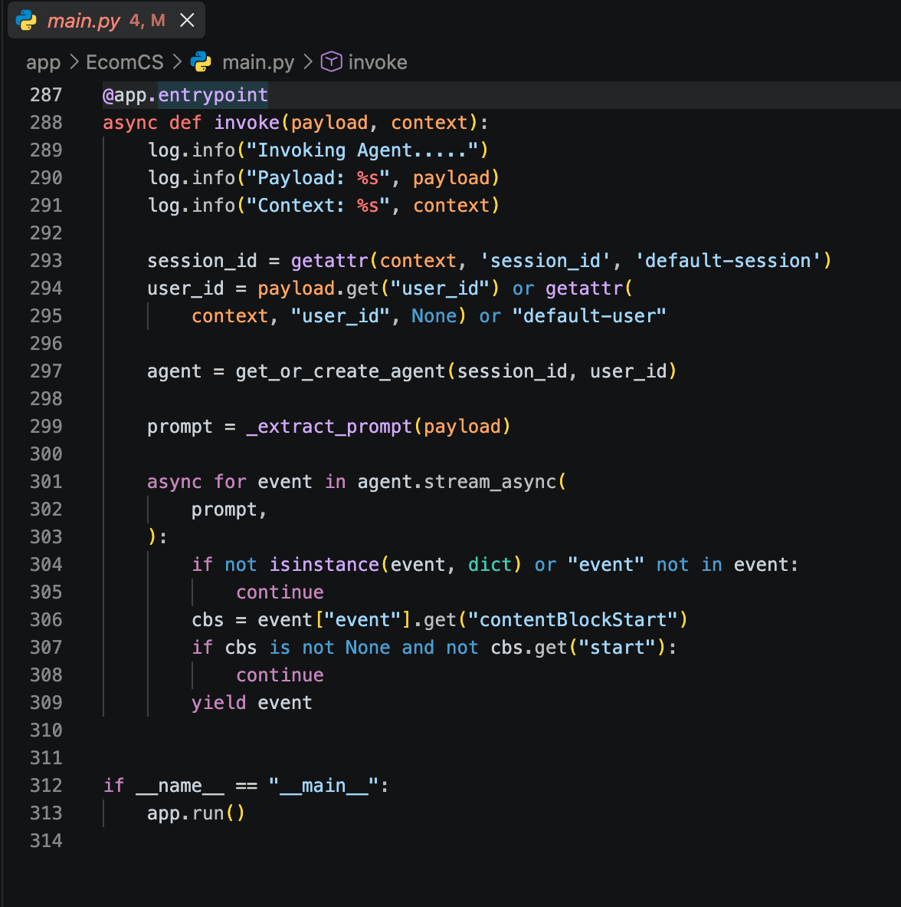

- Submitted test output shows the agent responding to an `agentcore invoke` command without errors.

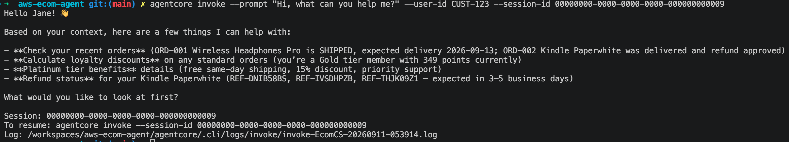

#### 2. Integrate external tools using the Model Context Protocol

- Code connects to a Gateway endpoint using `MCPClient`.

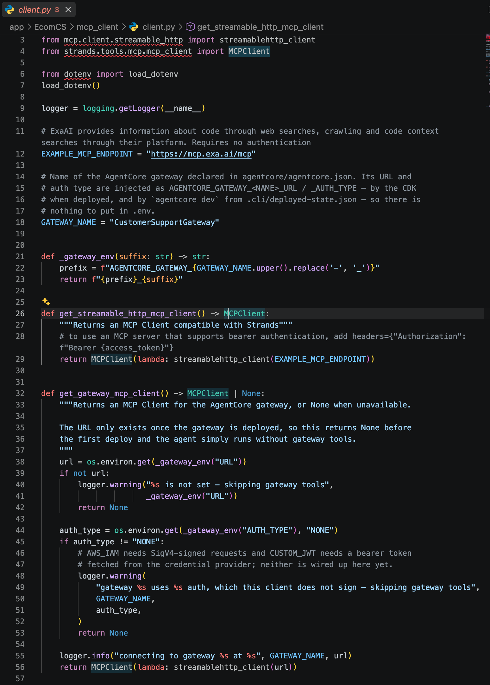

- Code loads Gateway tools and adds them to the agent's tools list.

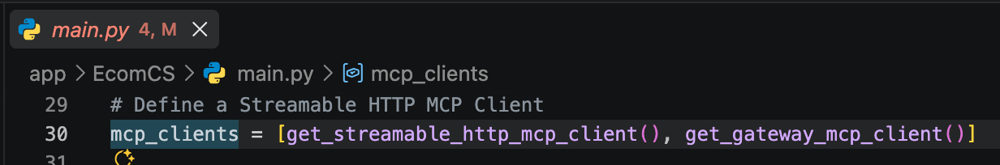

- Submitted test conversation log includes successful invocations of at least two distinct Gateway-backed tools (one API-based target, one Lambda-based target).
- Each tool invocation in the test log returns a well-formed response (not an error or empty result).

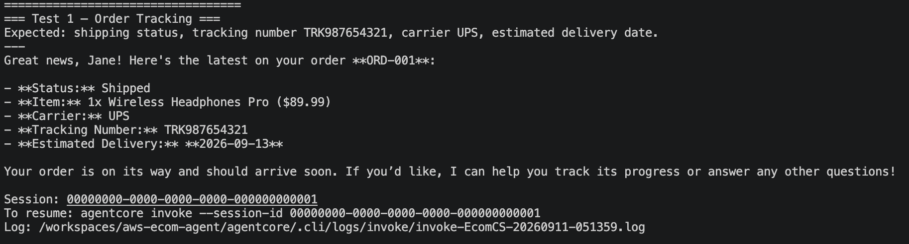

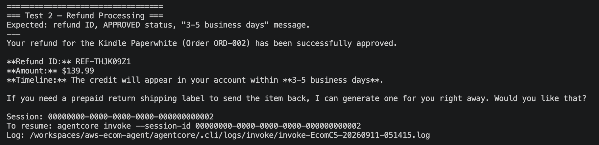

### Agent Intelligence

#### 3. Implement Retrieval Augmented Generation with a knowledge base

- Code includes a `search_knowledge_base` function using the `@tool` decorator.

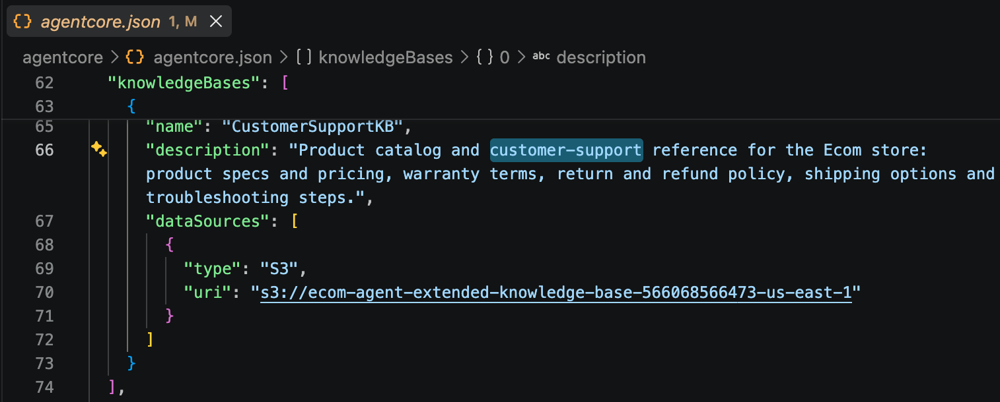

- The tool function calls the Retrieve API.

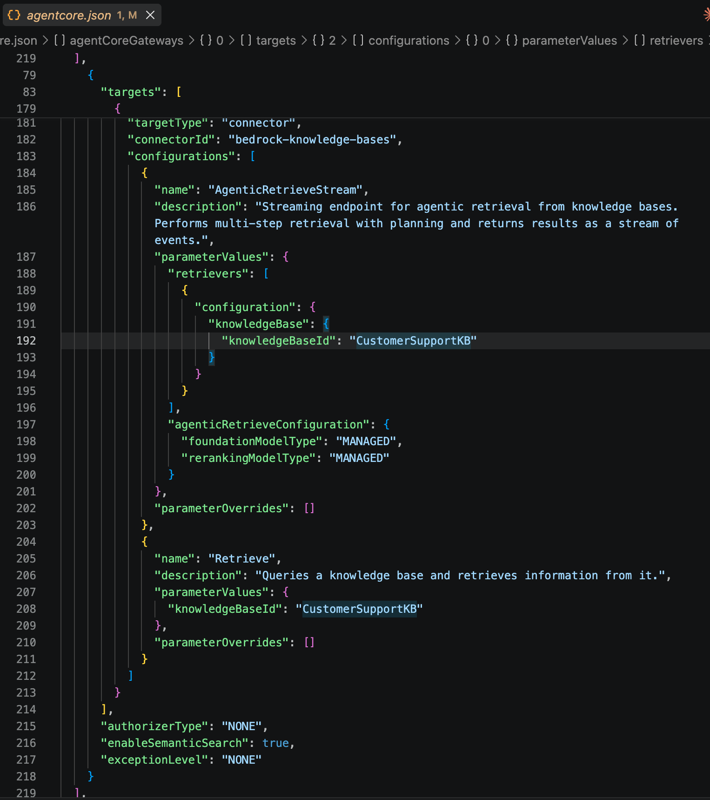

- The tool function joins retrieved text chunks and returns them as a single formatted string.

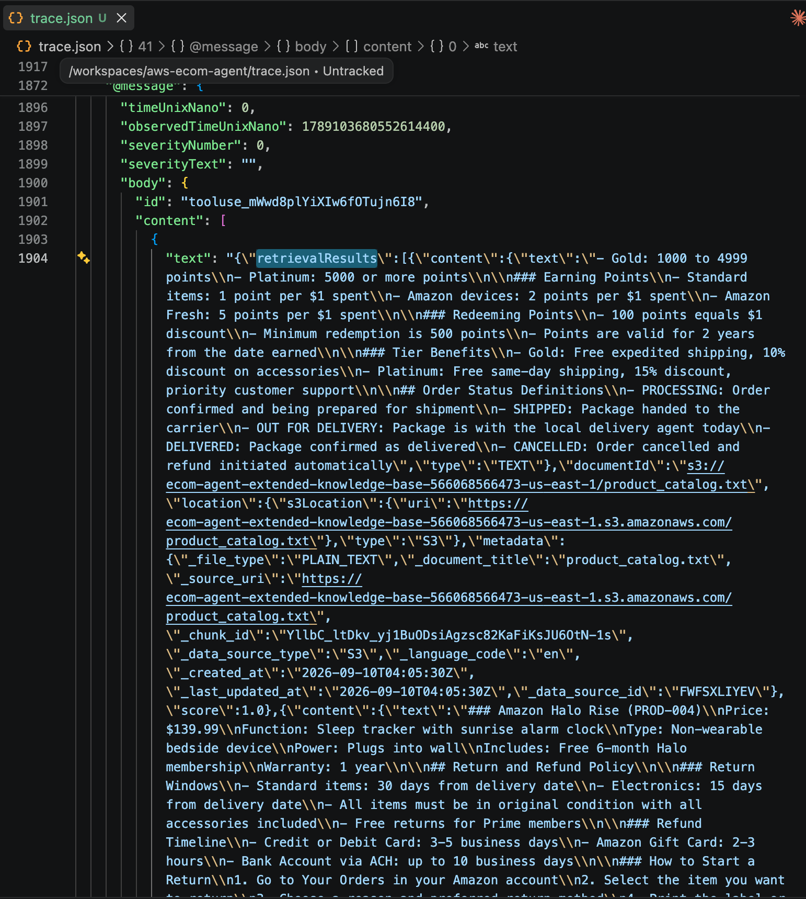

- Code includes a guard clause that returns a descriptive message when `KB_ID` is not configured.
- The `@tool`-decorated function includes a docstring that describes when the agent should call it.

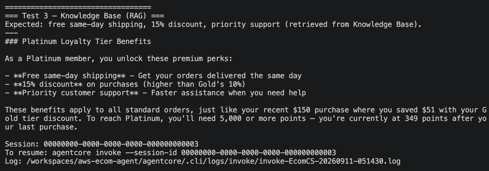

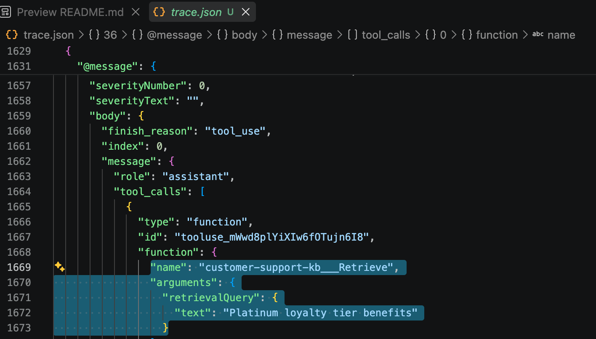

#### 4. Implement cross-session agent memory with retrieval and persistence

- Code includes a `get_namespaces` function that fetches strategy types and namespace templates from the memory resource, using `namespaceTemplates` or the legacy `namespaces` field.
- A `MemoryHook` class extends `HookProvider` and registers hooks via a `register_hooks` method.
- Code includes a `retrieve_customer_context` function that queries all strategy namespaces, tags memories by strategy type, and prepends them to the user message.
- Code includes a `save_support_interaction` function that extracts the last user query and assistant response and calls `memory_client.create_event()`.

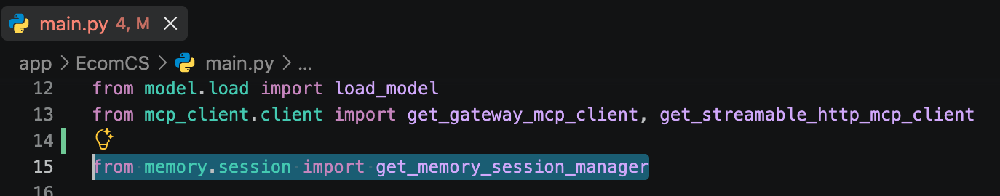

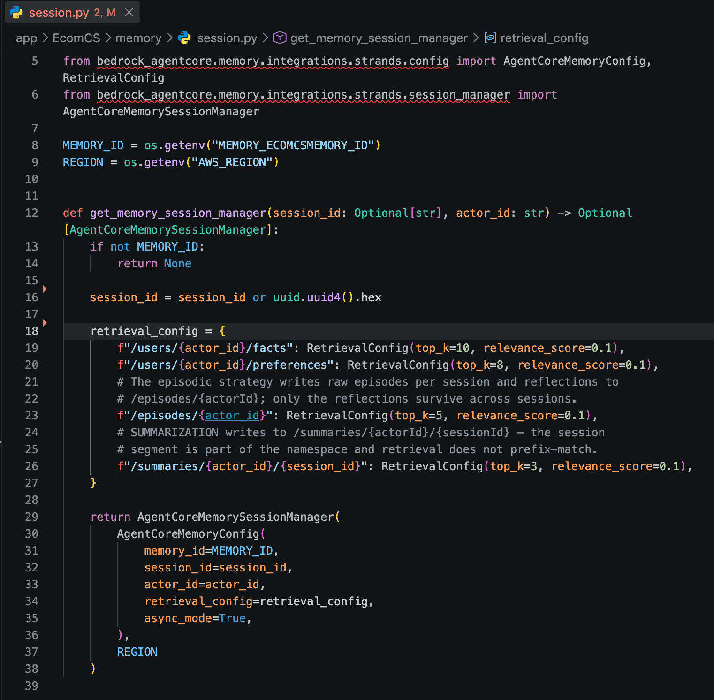

- Submitted test conversation log demonstrates cross-session recall: two separate sessions using the same customer ID, where the second session retrieves information stored in the first.

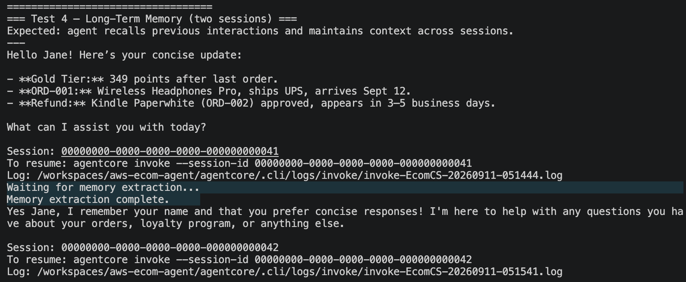

#### 5. Execute computational tasks via a sandboxed code interpreter

- Code includes a `calculate_loyalty_discount` function using the `@tool` decorator.
- The tool function builds a self-contained Python code string that encodes business rules for points redemption, tier discounts, and earn rates.
- Code executes the code string via `code_session(REGION).invoke("executeCode", ...)` with `clearContext=True`.
- Code includes a fallback path that computes a tier-only discount when the code interpreter is unavailable.
- The tool returns a structured result containing all of the following fields: `points_redeemed`, `tier_discount_pct`, `final_total`, `remaining_points`.

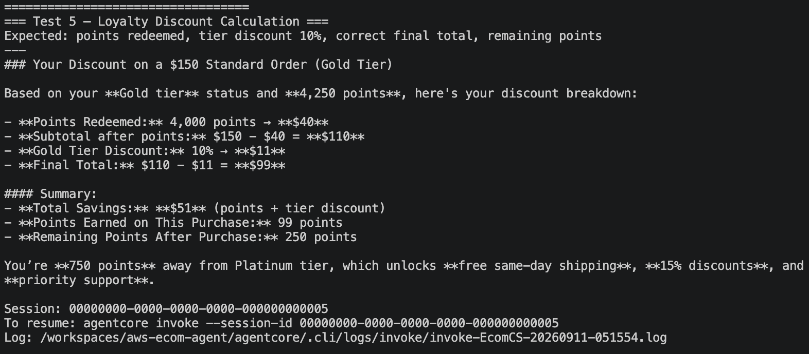

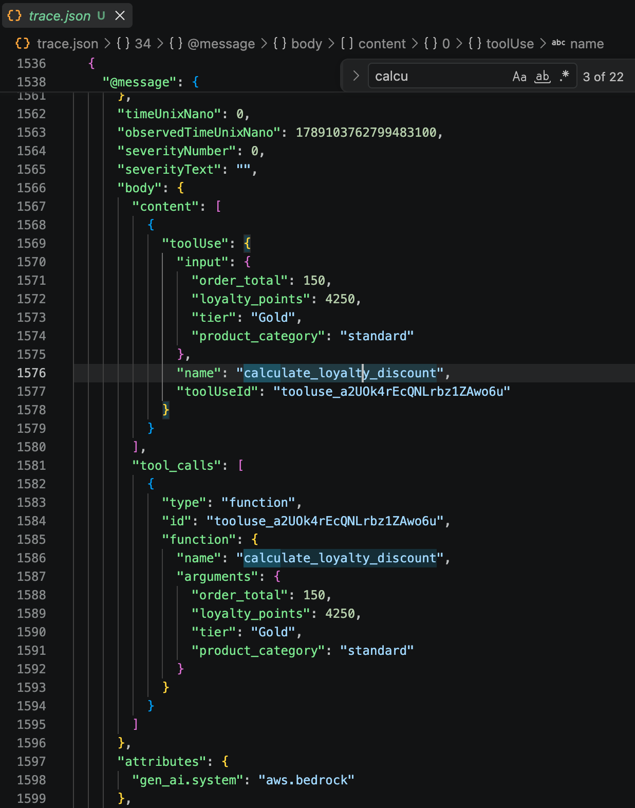

#### 6. Enable web browsing capabilities through a browser tool

- Code instantiates `AgentCoreBrowser` with the AWS region.
- Code adds the agentcore browser to the agent's tools list.
- Submitted test output shows the agent retrieving content from a live web page.

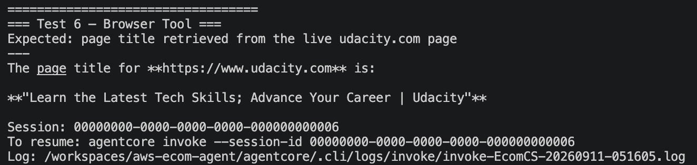

### Code Quality & Reflection

- Submission includes a written reflection of 200–400 words.
- Reflection names a specific tool or integration from the project and explains why an implementation choice was made.
- Reflection describes a concrete challenge encountered during the project and the steps taken to resolve it.
- Reflection discusses at least one production consideration (e.g., scalability, cost, security, monitoring) with a specific example of how it applies to this agent.

> The Project uses:  
> - CloudFormation stack in [/infra/ecomcs-extended-infra.yaml](../infra/ecomcs-extended-infra.yaml) to deploy pre-requisite resources, aka lambda functions, S3, and REST API-gateway.  
> - Agent stack, using managed CDK from AgentCore CLI. We can update agent resouces through [/agentcore/agentcore.json](../agentcore/agentcore.json).   
> - Completely do not use AWS Console Web interface.   
> => The challenge is how to sync between stack.  
>   - AgentCore CLI is quite new and lack of documentation, so quite tricky.  
>   - The CDK is managed by AgentCore CLI, how to sync resources information is not straightforward
>  
> Remarkable differences from AgentCore CLI:  
> 1. Knowledge base is accessed as Agentcore Gateway Target.
> 2. Longterm memory is not simply attach everything but Agent will retrive related information using k-mean and similarity thresholds.
>  
> A few Production note:  
>  - Need to evaluate the accuracy of the model.
>  - Need to implement guardrails for safetyness
>  - Need a way to sync the infrastructure and Knowledge base content.
>  - Multiple authentication and authorization machanism, such as Cognito, API keys, or IAM.  
>  - VPC and network controls.  
>  - Integrate with application or 3rd API.  
>  - Use difference model or quota to manage cost.  
>  
> Tools Reflection:  
> - 02 lambda functions.  
> - API-gateway, connect to one lambda function.  
> - AgentCore Runtime, agent deployments.
> - AgentCore Gateway, work as an MCP.
> - AgentCore Gateway Targets.  
>   - REST API.  
>   - Lambda (directly).  
>   - Knowledge bas (from S3).  
>   - Longterm memory (fact/preferences/episodes/summaries) using similarity search (k-means).  
>   - Code intepreter tool to allow agent execute/call function to get result.  
>   - Browser tool, to access internet for up-to-date data.  